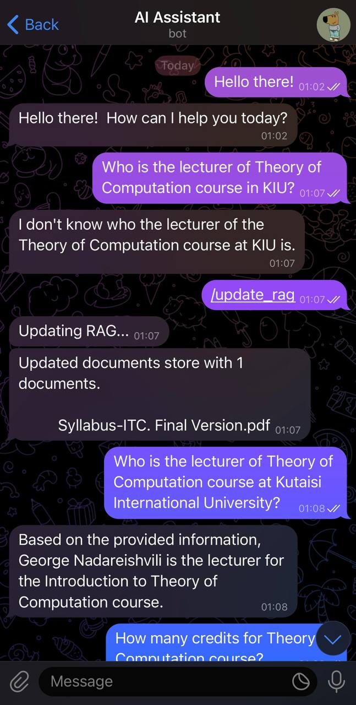
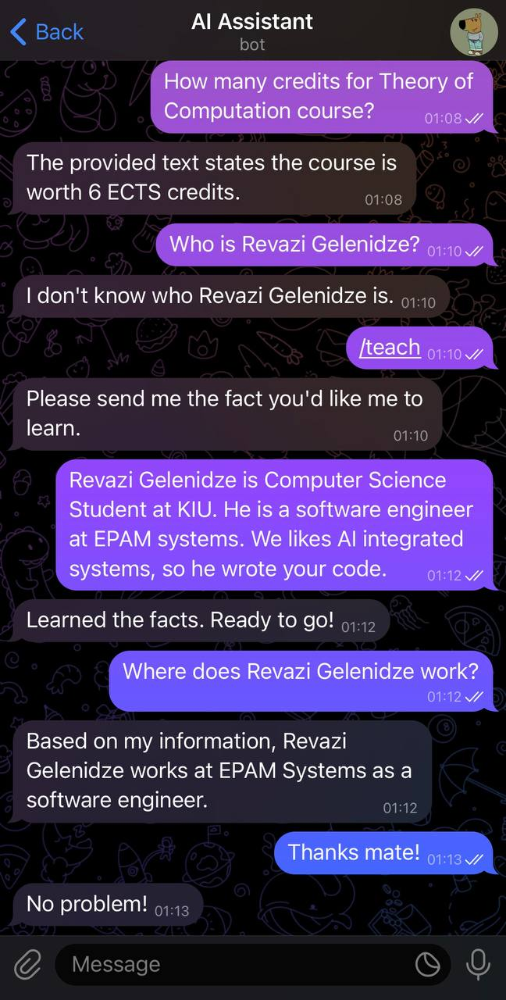

# RAG Assistant

A Retrieval-Augmented Generation (RAG) assistant that combines document knowledge with user-taught facts to provide intelligent responses through a Telegram bot interface.

## Demonstration

<div>
  
  
</div>

## Architecture

The system uses a modular architecture with clear separation of concerns:

```
brain/                    # Core application module
├── main.py              # FastAPI application entry point
├── settings.py          # Configuration management
├── chat/                # Chat interface layer
│   └── vendor/          # Platform-specific implementations
├── core/                # Business logic
│   ├── callback.py      # Request routing
│   ├── prompt.py        # Q&A processing chain
│   ├── teach.py         # Fact learning chain
│   └── utils/           # Core utilities
├── embedding/           # Text embedding module
├── llm/                 # Language model integration
├── vectorstore/         # Vector database operations
└── docs/               # Document storage
```

## Technology Stack

- **Framework**: FastAPI for async web application
- **Vector Database**: Qdrant for similarity search
- **Embeddings**: Nomic AI text embeddings (768-dim) running locally
- **LLM**: Google Gemini 1.5 Flash
- **Chat Platform**: Telegram Bot API
- **Orchestration**: LangChain for processing pipelines

## Core Components

### Vector Storage
Two collections store different knowledge types:
- `documents_collection`: Processed documents from files
- `facts_collection`: User-taught facts as structured triples

### Processing Chains

**PROMPT Chain** (Q&A):
1. Query both document and fact collections in parallel
2. Assemble context with user question into prompt
3. Generate response using Gemini LLM

**TEACH Chain** (Learning):
1. Extract structured fact triples from user input
2. Store normalized triples in facts collection

**UPDATE_RAG Chain**:
1. Process documents from `brain/docs/` directory
2. Update document collection with new embeddings

### Chat Interface
Telegram bot provides three command types:
- `/start` - Welcome message
- `/teach` - Interactive fact learning
- `/update_rag` - Refresh document store
- Regular messages - Standard Q&A queries

## Setup

### Prerequisites
- Docker and Docker Compose
- Telegram Bot Token
- Google API Key (Gemini access)

### Environment Configuration

1. Copy environment template:
```bash
cp .env.example .env
```

2. Configure `.env` file:
```env
TELEGRAM_BOT_TOKEN=your_telegram_bot_token
GOOGLE_API_KEY=your_google_api_key
QDRANT_URL=http://qdrant:6333
```

### Document Preparation
Place your documents (PDF, DOCX, TXT) in the `brain/docs/` directory before starting the system.

### Running the System

Start all services:
```bash
docker-compose up --build
```

This will:
- Start Qdrant vector database on port 6333
- Build and run the FastAPI backend on port 8000
- Initialize embeddings and vector collections
- Start the Telegram bot

### Service Access
- **Qdrant Dashboard**: http://localhost:6333/dashboard
- **Telegram Bot**: Search for your bot on Telegram and say Hi!

## Usage

### Basic Q&A
Send any question to the bot. It will search both document and fact collections to provide contextual answers.

### Teaching Facts
1. Send `/teach` command
2. Provide the fact you want the bot to learn
3. The system extracts and stores structured information

### Updating Documents
Send `/update_rag` to process new documents added to the `brain/docs/` directory.

## Configuration

### Model Settings
- **Similarity Threshold**: 0.65 (adjustable in `settings.py`)
- **LLM Temperature**: 0 (deterministic responses)
- **Embedding Dimensions**: 768

### Scaling Considerations
- Qdrant supports horizontal scaling
- FastAPI handles concurrent requests efficiently
- Embedding model runs locally for privacy

## Development

The modular design allows independent development of components:
- Add new chat platforms in `chat/vendor/`
- Extend processing chains in `core/`
- Swap LLM providers in `llm/`
- Change vector databases in `vectorstore/`

## Performance considerations

Running Nomic AI embeddings inside Docker may lead to performance degradation due to resource constraints. 
For optimal performance, consider running the embedding model directly on the host machine or in a 
dedicated environment outside of Docker.

You can start Qdrant from docker and run the brain component as a standalone local FastAPI app.

Go to the `rag-assistant/` directory and run:

```bash
uvicorn brain.main:app
```

Happy hacking!
